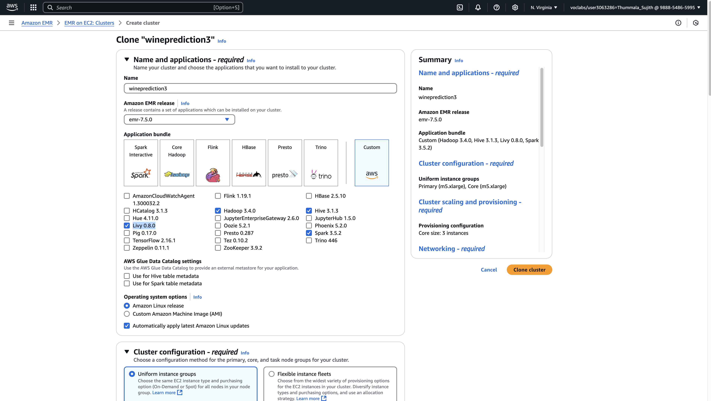

# Wine Quality Prediction AWS Spark Application

This project demonstrates the application of machine learning for wine quality prediction using the PySpark interface on an AWS Elastic MapReduce (EMR) cluster. The goal is to train a machine learning model using provided datasets, deploy it on an EC2 instance in the AWS cloud, and use Docker to containerize the trained model for deployment and testing.

# Overview:

The application uses a machine learning model to predict the quality of wine based on various chemical properties. The model is trained using PySpark on an AWS EMR cluster to handle large-scale computations in parallel across multiple EC2 instances. Once the model is trained, it is saved and tested using a separate dataset. Additionally, the model is containerized with Docker to facilitate easy deployment and reproducibility.

# Project Structure:

Training Dataset: The TrainingDataset.csv file contains the features used to train the model.

Validation Dataset: The ValidationDataset.csv file is used to validate the model after training.

Test Dataset: The TestDataset.csv file is used to evaluate the model's performance after training.

Model: The trained machine learning model is saved and stored in an S3 bucket.

# Links:

Docker Hub: Wine Quality Prediction Docker Image

https://hub.docker.com/r/sujith345/predquilty

Before you start, you need the following:

AWS Account: Set up an AWS account if you don't already have one.

Docker Account: Create a Docker Hub account for pushing and pulling the model container image.

AWS CLI: Install and configure AWS CLI to interact with AWS services.

Setup and Execution Steps:

1. Create a Key Pair for the EMR Cluster

Go to the EC2 console on AWS and navigate to Key Pairs under the Network & Security section.

Create a new key pair named sujith.pem. Download the .pem file as 
you will use it to access the EC2 instances in the EMR cluster.

2. Create an S3 Bucket:

In the S3 console, create a new S3 bucket with the name wineprediction3 (or any name you prefer).

This bucket will be used to store the datasets and the trained machine learning model.

3. Create an EMR Cluster

Go to the EMR console in AWS.

Create a new cluster with the following configuration:
Cluster Name: wineprediction3
Amazon EMR release version: emr-7.5.0
Applications: Hadoop 3.4.0, Spark 3.5.2, Hive 3.1.3, JupyterEnterpriseGateway 2.6.0, Livy 0.8.0
Choose 4 EC2 instances for the cluster (1 primary node and 3 core nodes).
Configure networking, security, and termination settings based on your needs.

4. Connect to the Primary Node
After the cluster is running:

Use SSH to connect to the master node in the EMR cluster. Use the .pem file you downloaded earlier:

ssh -i "sujith.pem" ec2-user@<Master-Node-IP>
This will open a terminal session in the master EC2 instance.

5. Upload Datasets to S3

Upload the following files to your S3 bucket (wineprediction3/datasets):

TrainingDataset.csv
ValidationDataset.csv

You can upload files either through the AWS console or using the AWS CLI:

aws s3 cp TrainingDataset.csv s3://wineprediction3/datasets/
aws s3 cp ValidationDataset.csv s3://wineprediction3/datasets/

6. Train the Machine Learning Model

Once connected to the master node, use the following command to train the model on your data using Spark:

spark-submit qualityprediction.py s3://wineprediction3/datasets/TrainingDataset.csv s3://wineprediction3/datasets/ValidationDataset.csv

The qualityprediction.py script will train the machine learning model on the training dataset and validate it using the validation dataset.

The training dataset will be split into 90% for training and 10% for testing. The test data will be saved as TestDataset.csv in the 
S3 bucket:

aws s3 cp TestDataset.csv s3://wineprediction3/datasets/

7. Save the Model

After training, save the model in your S3 bucket for later use:

aws s3 cp wine_quality_model s3://wineprediction3/models/wine_quality_model

8. Test the Model
To test the model, run the following command:

spark-submit qualitytestPrediction.py s3://wineprediction3/datasets/TestDataset.csv s3://wineprediction3/models/wine_quality_model
This will use the trained model to make predictions on the test dataset.

9. Docker Integration

Install Docker: Follow the instructions on the Docker website to install Docker on your local machine.

Create a Docker Account: Sign up at Docker Hub if you don't already have an account.

Build the Docker Image:

Clone the GitHub repository and navigate to the directory containing the Dockerfile.

Build the Docker image using the following command:

docker build -t predquilty .

Tag the Image:

docker tag predquilty sujith345/predquilty

Push the Image to Docker Hub:

docker push sujith345/predquilty

Pull the Image from Docker Hub:

docker pull sujith345/predquilty

Run the Docker Container:

docker run --rm sujith345/predquilty /app/datasets/TestDataset.csv /app/models

Conclusion:

Model Accuracy: 0.758
F1 Score: 0.747

The machine learning model was able to predict wine quality with a good level of accuracy. The project demonstrates the use of AWS EMR, PySpark, and Docker for scalable model training and deployment. Future work can include improving model performance by tuning hyperparameters and training with larger datasets